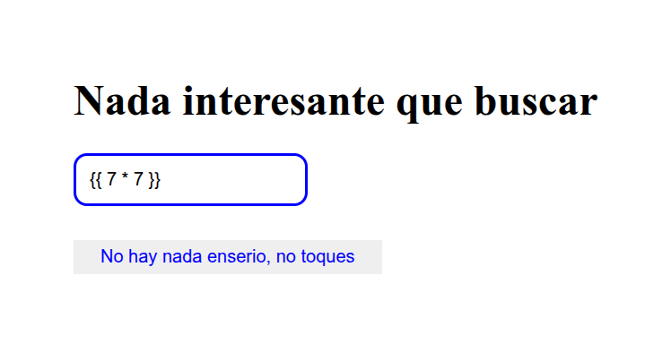
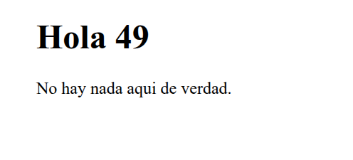

# Table of Contents

1.  [machine setup](#org2bed5c7)
2.  [SSTI - Server Side Template Injection](#orgb80b4ee)
3.  [Detection](#org358df90)

# machine setup

**give permissions to the file** ->

    chmod +x auto_deploy.sh

**initial scan** ->

    nmap -vv -T5 172.17.0.2
    
    Nmap scan report for 172.17.0.2
    Host is up, received syn-ack (0.00038s latency).
    Scanned at 2025-09-21 12:22:11 -03 for 0s
    Not shown: 997 closed tcp ports (conn-refused)
    PORT     STATE SERVICE REASON
    22/tcp   open  ssh     syn-ack
    80/tcp   open  http    syn-ack
    8089/tcp open  unknown syn-ack

# SSTI - Server Side Template Injection

Is a vulnerability that occurs when an attacker can inject malicious code into a template that is executed on the server.

This vulnerability can be found in various technologies, including Jinja

    output = template.render(name=request.args.get('name'))

This code is vulnerable, tha name parameter form te user request is directly passed into the template using the render function.

This can potentially allow an attacker to inject malicious code into the name parameter, leading to server-side template injection.

-   at this case, an attacker could craft a request with a payload like this ->
    
        https://vulnerable-site.com/?name={{payload}}

This payload could contains Jinja template directives that enable the attacker to execute unauthorized code or manipulate the template engine.

# Detection

To detect Server-Side Template Injection, initially, fuzzing the template is a straightforward approach. This involves injecting a sequence of special caracters **(${{<%[%&rsquo;"]}%\\})** into the template and analyzing the differences in the server response to regular data versus this special payload. Vulnerability indicators include:

-   Thrown errors, revealing the vulnerability and potentially the template engine
-   Absence of the payload in the reflection, or parts of it missing, implying the server processes it differentyl than regular data.

-   **Plaintext Context**  -> Distinguish from XSS by checking if the server evaluates template expressions **({{ 7 \* 7 }}, ${ 7 \* 7  })**

-   **Code Context** -> Confirm vulnerability by altering input parameters.
    
    ---
    
    **flowchart** ->

**Testing at verdejo application** ->

